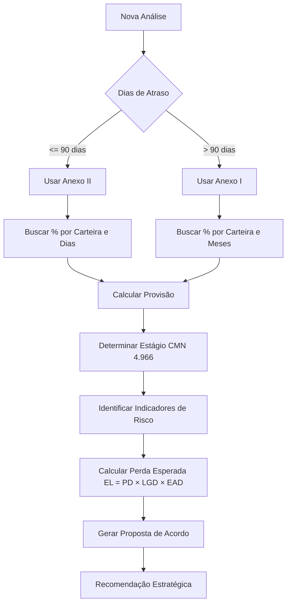

# Estrutura do Banco de Dados - Gestão de Passivo Bancário

## Visão Geral

Este documento descreve a estrutura completa do banco de dados para o módulo de Gestão de Passivo Bancário do INTELLIBANK, incluindo tabelas de provisão conforme Resolução BCB 352/2023 e classificação por estágios conforme Resolução CMN 4.966/2021.

---

## Tabelas

### 1. `bancos_brasil`

Cadastro de bancos brasileiros com informações de segmentação prudencial.

**Colunas:**
- `id` (UUID, PK) - Identificador único
- `codigo_compe` (TEXT, UNIQUE) - Código de compensação (ex: "001", "237")
- `nome_completo` (TEXT) - Nome completo do banco
- `nome_curto` (TEXT) - Nome abreviado para exibição
- `segmento_bcb` (TEXT) - Segmentação prudencial: "S1", "S2", "S3", "S4", "S5"
- `ativo` (BOOLEAN) - Se o banco está ativo
- `created_at` (TIMESTAMP)

**Índices:**
- `idx_bancos_compe` em `codigo_compe`
- `idx_bancos_segmento` em `segmento_bcb`

**RLS:** Leitura pública para usuários autenticados

---

### 2. `provisao_bcb352_anexo1`

Tabela de provisão para **Perda Incorrida** - Contratos com atraso **superior a 90 dias**.

Baseada no Anexo I da Resolução BCB 352/2023.

**Colunas:**
- `id` (UUID, PK)
- `faixa_meses` (TEXT) - Descrição da faixa (ex: "3 a 5 meses")
- `meses_min` (INTEGER) - Meses mínimos da faixa
- `meses_max` (INTEGER, NULLABLE) - Meses máximos (NULL para "21+ meses")
- `c1_percentual` (NUMERIC(5,2)) - Percentual para Carteira C1
- `c2_percentual` (NUMERIC(5,2)) - Percentual para Carteira C2
- `c3_percentual` (NUMERIC(5,2)) - Percentual para Carteira C3
- `c4_percentual` (NUMERIC(5,2)) - Percentual para Carteira C4
- `c5_percentual` (NUMERIC(5,2)) - Percentual para Carteira C5
- `created_at` (TIMESTAMP)

**Dados Iniciais:**
| Faixa | Meses Min | Meses Max | C1 % | C2 % | C3 % | C4 % | C5 % |
|-------|-----------|-----------|------|------|------|------|------|
| Menor que 1 mês | 0 | 0 | 10.00 | 5.00 | 5.00 | 5.00 | 10.00 |
| 1 a 2 meses | 1 | 2 | 20.00 | 10.00 | 10.00 | 10.00 | 20.00 |
| 3 a 5 meses | 3 | 5 | 30.00 | 20.00 | 20.00 | 20.00 | 30.00 |
| 6 a 8 meses | 6 | 8 | 50.00 | 30.00 | 30.00 | 30.00 | 50.00 |
| 9 a 11 meses | 9 | 11 | 70.00 | 50.00 | 50.00 | 50.00 | 70.00 |
| 12 a 14 meses | 12 | 14 | 90.00 | 70.00 | 70.00 | 70.00 | 90.00 |
| 15 a 17 meses | 15 | 17 | 90.00 | 90.00 | 90.00 | 90.00 | 90.00 |
| 18 a 20 meses | 18 | 20 | 90.00 | 90.00 | 90.00 | 90.00 | 90.00 |
| 21+ meses | 21 | NULL | 100.00 | 100.00 | 100.00 | 100.00 | 100.00 |

**RLS:** Leitura pública para usuários autenticados

---

### 3. `provisao_bcb352_anexo2`

Tabela de provisão para **Perda Esperada** - Contratos com atraso **de 0 a 90 dias**.

Baseada no Anexo II da Resolução BCB 352/2023.

**Colunas:**
- `id` (UUID, PK)
- `faixa_dias` (TEXT) - Descrição da faixa (ex: "31 a 60 dias")
- `dias_min` (INTEGER) - Dias mínimos da faixa
- `dias_max` (INTEGER) - Dias máximos da faixa
- `c1_percentual` (NUMERIC(5,2)) - Percentual para Carteira C1
- `c2_percentual` (NUMERIC(5,2)) - Percentual para Carteira C2
- `c3_percentual` (NUMERIC(5,2)) - Percentual para Carteira C3
- `c4_percentual` (NUMERIC(5,2)) - Percentual para Carteira C4
- `c5_percentual` (NUMERIC(5,2)) - Percentual para Carteira C5
- `created_at` (TIMESTAMP)

**Dados Iniciais:**
| Faixa | Dias Min | Dias Max | C1 % | C2 % | C3 % | C4 % | C5 % |
|-------|----------|----------|------|------|------|------|------|
| 0 a 14 dias | 0 | 14 | 0.50 | 0.25 | 0.25 | 0.25 | 0.50 |
| 15 a 30 dias | 15 | 30 | 1.00 | 0.50 | 0.50 | 0.50 | 1.00 |
| 31 a 60 dias | 31 | 60 | 3.00 | 1.50 | 1.50 | 1.50 | 3.00 |
| 61 a 90 dias | 61 | 90 | 10.00 | 5.00 | 5.00 | 5.00 | 10.00 |

**RLS:** Leitura pública para usuários autenticados

---

### 4. `analises_gestao_passivo`

Tabela principal de análises de contratos em inadimplência.

**Colunas Principais:**

#### Identificação
- `id` (UUID, PK)
- `usuario_id` (UUID, FK)
- `numero_contrato` (TEXT)
- `cliente_id` (UUID, FK)
- `banco_id` (UUID, FK → bancos_brasil)
- `banco_nome` (TEXT) - Desnormalizado para performance
- `banco_codigo_compe` (TEXT)
- `banco_segmento` (TEXT)

#### Dados do Contrato
- `tipo_operacao` (TEXT) - Ex: "Empréstimo Pessoal", "Capital de Giro"
- `tipo_pessoa` (TEXT) - "PF" ou "PJ"
- `valor_original` (NUMERIC(15,2))
- `saldo_devedor_atual` (NUMERIC(15,2))
- `data_contratacao` (DATE)
- `data_vencimento_original` (DATE, NULLABLE)
- `data_inadimplencia` (DATE)
- `dias_atraso` (INTEGER) - Calculado automaticamente
- `meses_atraso` (INTEGER) - Calculado automaticamente

#### Garantias
- `possui_garantias` (BOOLEAN)
- `tipo_garantias` (TEXT[]) - Array de tipos
- `valor_garantias` (NUMERIC(15,2))
- `descricao_garantia` (TEXT)

#### Classificação
- `carteira_bcb352` (TEXT) - "C1" a "C5"
- `estagio_cmn4966` (INTEGER) - 1, 2 ou 3
- `em_default` (BOOLEAN) - TRUE se > 90 dias
- `motivo_default` (TEXT[]) - Array de motivos

#### Provisão
- `percentual_provisao_bcb352` (NUMERIC(5,2))
- `valor_provisao_bcb352` (NUMERIC(15,2))
- `tipo_provisao` (TEXT) - "ANEXO_I" ou "ANEXO_II"

#### Proposta de Acordo
- `valor_proposta_acordo` (NUMERIC(15,2))
- `percentual_proposta_acordo` (NUMERIC(5,2))
- `percentual_desconto` (NUMERIC(5,2))
- `marco_provisionamento` (TEXT)
- `momento_negociacao` (TEXT)
- `status_negociacao` (TEXT)

#### Reestruturação
- `foi_reestruturado` (BOOLEAN)
- `data_reestruturacao` (DATE, NULLABLE)
- `provisao_adicional_reestruturacao` (NUMERIC(15,2))

#### Observações
- `fundamentacao_juridica` (TEXT)
- `estrategia_negociacao` (TEXT)
- `observacoes` (TEXT)
- `created_at` (TIMESTAMP)
- `updated_at` (TIMESTAMP)

**Índices:**
- `idx_analises_usuario_id` em `usuario_id`
- `idx_analises_banco_id` em `banco_id`
- `idx_analises_carteira` em `carteira_bcb352`
- `idx_analises_estagio` em `estagio_cmn4966`

**RLS:** Isolamento por escritório usando `get_user_escritorio_id()`

---

## Carteiras BCB 352

As carteiras classificam operações por tipo:

- **C1** - Varejo Não Consignado (Cartão, Cheque Especial, Empréstimo Pessoal)
- **C2** - Varejo Consignado (Empréstimo Consignado)
- **C3** - Atacado (Capital de Giro, CCB Empresarial)
- **C4** - Arrendamento Mercantil (Financiamento de Veículo, Leasing)
- **C5** - Outros Ativos

---

## Estágios CMN 4.966

### Estágio 1 - Risco Normal 🟢
- Atraso < 30 dias
- Sem indicadores de deterioração
- Provisão: 12 meses de perda esperada

### Estágio 2 - Risco Aumentado 🟡
- Atraso entre 30 e 90 dias
- Indicadores de deterioração presentes
- Provisão: Perda esperada para toda a vida

### Estágio 3 - Default 🔴
- Atraso > 90 dias
- Reestruturação, falência, medida judicial
- Provisão: Perda esperada para toda a vida

---

## Fluxo de Cálculo



---

## Bibliotecas de Cálculo

### `src/lib/calculoProvisaoBCB352.ts`
- `determinarEstagioCMN4966()` - Classifica estágio de risco
- `identificarIndicadoresRisco()` - Identifica indicadores de deterioração
- `calcularPerdaEsperada()` - Calcula EL = PD × LGD × EAD
- `buscarPercentualAnexo1()` - Busca provisão para >90 dias
- `buscarPercentualAnexo2()` - Busca provisão para 0-90 dias
- `buscarPercentualProvisaoBCB352()` - Determina qual anexo usar

### `src/lib/calculoGestaoPassivo.ts`
- `calcularGestaoPassivo()` - Orquestra cálculo completo
- `determinarMarcoProvisionamento()` - Define marco (50%, 90%, 100%)
- `determinarMomentoNegociacao()` - Define momento ideal
- `gerarRecomendacaoEstrategica()` - Gera texto de recomendação

---

## Hooks Disponíveis

### `src/hooks/useGestaoPassivo.ts`
- `useGestaoPassivo()` - Lista todas as análises
- `useGestaoPassivoById(id)` - Busca uma análise específica
- `useCreateGestaoPassivo()` - Cria nova análise
- `useUpdateGestaoPassivo()` - Atualiza análise existente
- `useBancosBrasil()` - Lista bancos ativos

### `src/hooks/useProvisaoBCB352.ts`
- `useProvisaoAnexo1()` - Dados completos do Anexo I
- `useProvisaoAnexo2()` - Dados completos do Anexo II
- `usePercentualAnexo1(carteira, meses)` - Percentual específico
- `usePercentualAnexo2(carteira, dias)` - Percentual específico

---

## Segurança

### Row Level Security (RLS)

Todas as tabelas têm RLS habilitado:

- **Tabelas de provisão:** Leitura pública para usuários autenticados
- **analises_gestao_passivo:** Isolamento por escritório
  ```sql
  escritorio_id = get_user_escritorio_id()
  ```

### Validações

- `tipo_pessoa` CHECK: apenas 'PF' ou 'PJ'
- `estagio_cmn4966` CHECK: apenas 1, 2 ou 3
- `tipo_provisao` CHECK: apenas 'ANEXO_I' ou 'ANEXO_II'

---

## Exemplos de Consulta

### Buscar percentual de provisão (Anexo I)
```sql
SELECT c1_percentual, c2_percentual, c3_percentual, c4_percentual, c5_percentual
FROM provisao_bcb352_anexo1
WHERE meses_min <= 10
  AND (meses_max >= 10 OR meses_max IS NULL);
```

### Buscar percentual de provisão (Anexo II)
```sql
SELECT c1_percentual, c2_percentual, c3_percentual, c4_percentual, c5_percentual
FROM provisao_bcb352_anexo2
WHERE dias_min <= 45 AND dias_max >= 45;
```

### Estatísticas por estágio
```sql
SELECT 
  estagio_cmn4966,
  COUNT(*) as total_contratos,
  SUM(saldo_devedor_atual) as total_saldo,
  SUM(valor_provisao_bcb352) as total_provisao
FROM analises_gestao_passivo
WHERE escritorio_id = get_user_escritorio_id()
GROUP BY estagio_cmn4966
ORDER BY estagio_cmn4966;
```

---

## Manutenção

### Atualizações de Percentuais

Os percentuais das tabelas de provisão são baseados em regulamentação. 
Para atualizar:

```sql
UPDATE provisao_bcb352_anexo1
SET c1_percentual = 15.00
WHERE faixa_meses = 'Menor que 1 mês';
```

### Backup Recomendado

```bash
# Backup das tabelas de provisão
pg_dump -t provisao_bcb352_anexo1 -t provisao_bcb352_anexo2 > provisao_backup.sql
```

---

## Referências Regulatórias

- **Resolução BCB 352/2023** - Provisão para Créditos de Liquidação Duvidosa
- **Resolução CMN 4.966/2021** - Classificação de Risco e Provisionamento
- **Circular BCB 3.082/2002** - Regulamentação anterior (substituída)

---

*Documentação gerada em: {{ date }}*
*Versão do Sistema: 1.0.0*
